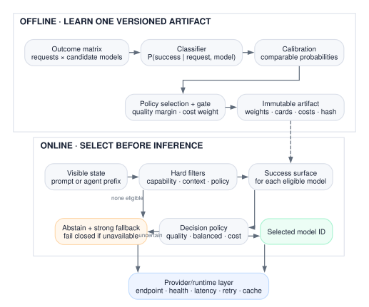
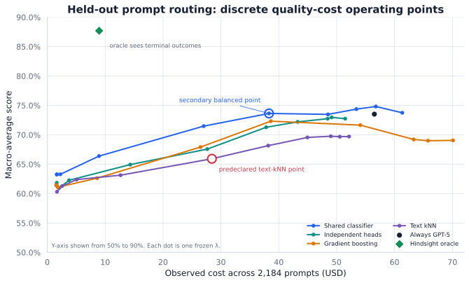
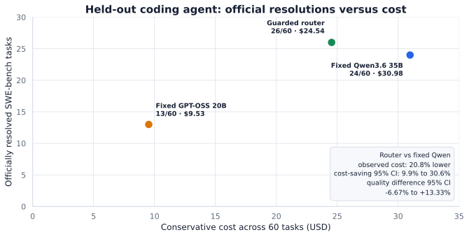
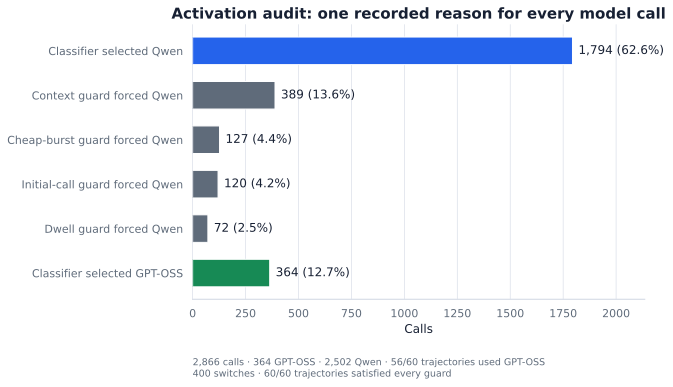

# What I learned building a model router for coding agents

*A technical guide to model selection, quality-cost curves, calibration, and
per-call agent routing—backed by an open-source implementation and held-out
SWE-bench evaluation.*

*Pranav Dulepet*

I wanted to answer a practical question: can a system choose the right model
before every inference, use cheaper models where they are sufficient, and
preserve the quality of a strong fixed model?

The usual description is simple. Classify a request as easy or hard. Send easy
requests to a cheap model and hard requests to a strong model.

That description leaves out most of the problem. Difficulty is not an
intrinsic label. A geometry problem, an API migration, and a UI edit may each
be easy for a different model. Classifier scores need calibration before they
can be compared. The selected model must satisfy context, tool, privacy, and
budget constraints. Inputs outside the training distribution need a fallback.
Inside an agent, every model call changes the state that the next decision
will see.

I built and open-sourced a router around those constraints. I first evaluated
one-shot routing over 13 models and 11,658 prompts. I then adapted the design
to route individual calls inside a coding agent.

On the predeclared 50-task SWE-bench subgroup drawn from repository families
excluded from fitting, the agent router and fixed Qwen3.6 35B each resolved
22 tasks. Conservative cost was $20.61 for the router and $26.02 for Qwen.
“Conservative” prices every input token at the uncached list rate for both
policies.

Across all 60 tasks, the router resolved 26 and fixed Qwen resolved 24, at
$24.54 and $30.98. The router used GPT-OSS 20B on 12.70% of its model calls.
Across those 60 tasks, the paired quality interval spans −6.67 to +13.33
percentage points. The experiment supports lower cost at the observed pass
rate, not a claim that the router is intrinsically more accurate.

That distinction shaped the implementation:

> A classifier estimates model fitness. A router turns those estimates into a
> constrained, calibrated, measurable policy.

## The problem is allocation, not difficulty

Suppose a model pool contains candidates \(m\in\mathcal M\), and \(x\) is the
request visible when the route is chosen. The quantity I care about is

\[
p_m(x)=P(\text{acceptable outcome}\mid x,m).
\]

This is a surface over requests and models, not a single difficulty score.
For the same request, two models can have different probabilities. For the
same model, two requests can have different probabilities.

Routing has value only if the pool contains useful variation:

- models occupy different quality-cost points;
- models disagree on which examples they solve;
- cheaper models are sufficient on a meaningful fraction of traffic; and
- some observable feature predicts that sufficiency.

The hindsight oracle measures the first three conditions. It selects the
highest observed outcome score after seeing every terminal result and breaks
ties by lower cost. The oracle is not deployable. It is an upper bound on the
opportunity available to a perfect router.

The oracle analysis changed how I framed the project. On my 13-model prompt
matrix, the oracle scored 87.70% at $8.96. Fixed GPT-5
scored 73.52% at $56.52. That gap says the model pool contains substantial
complementarity. It does not say a classifier can identify the right model
before inference.

This distinction appears throughout the literature. Early work by
[Shnitzer et al.](https://arxiv.org/abs/2309.15789) reframed benchmark results
as supervision for per-model correctness prediction. The newer
[LLMRouterBench](https://aclanthology.org/2026.findings-acl.1881/) confirms
strong complementarity but finds a persistent gap between learned routers and
the oracle. A common error is model recall: only one or two candidates solve a
request, and the router fails to identify them.

The model pool and the router must therefore be designed together. Adding
more models can increase the oracle while making the prediction problem
harder. LLMRouterBench finds diminishing returns from larger pools and more
value in careful model curation than in adding candidates indiscriminately.

## A map of the routing space

Several systems are called routers even though they make different decisions.

| System | Evidence available at decision time | Action | Main tradeoff |
|---|---|---|---|
| Predictive model router | Request, context, model metadata | Call one selected model | Cheap decision; limited evidence |
| Cascade | Request plus one or more generated answers | Accept or escalate | Better evidence; pays latency and tokens for discarded answers |
| Agent-step router | Current trajectory, tools, errors, budget | Select the next model | Can adapt; changes future state |
| Provider router | Selected model, endpoint health, cache, region | Select an endpoint or service tier | Reliability, latency, and infrastructure cost |

A predictive router decides before generation.
[RouteLLM](https://proceedings.iclr.cc/paper_files/paper/2025/hash/5503a7c69d48a2f86fc00b3dc09de686-Abstract-Conference.html)
is the canonical binary example: estimate whether a strong model will beat a
weak model, then sweep a threshold to vary the fraction of strong-model calls.

A cascade gets more information by generating first.
[FrugalGPT](https://arxiv.org/abs/2305.05176) sends a request through a
sequence of models and stops when a response is judged reliable. This can be
powerful, but an escalation pays for both the rejected response and the
stronger response. Predictive routing makes a harder decision with less
evidence, but normally invokes only one model.

Agent routing is a sequential control problem. It can select once for the
whole task, select a stage, or select before every model call. Per-call routing
has the finest control but also the strongest feedback loop: the chosen model
changes the next command, tool result, context length, and stopping time.

Provider routing begins after semantic selection. It handles endpoint
availability, rate limits, deadlines, regions, retries, and cache locality.
Combining semantic and provider routing into one opaque score makes both
layers harder to train and debug.

External model routing is sometimes described as a mixture of experts. The
gating analogy is useful, but the mechanisms differ.

| Sparse mixture of experts | External model router |
|---|---|
| Usually routes tokens inside one network | Usually routes a request or agent step |
| Experts are jointly trained modules | Models are independently trained systems |
| Training balances expert capacity and compute | Deployment balances quality, price, latency, and policy |
| Several experts may contribute to one token | Predictive routing normally calls one model |
| Router and experts share a training loop | Models can change without the router architecture changing |

An external router is a decision layer over a changing catalog of complete
systems.

## Five parts of a serious router

Implementing the first router forced me to separate five design problems.

| Part | Question |
|---|---|
| Model pool | Which candidates provide real quality, cost, latency, or capability diversity? |
| Outcome data | What does success mean, and where do representative labels come from? |
| Estimator | How do I predict each model’s outcome from the visible state? |
| Policy | How do predictions, costs, constraints, and fallback become a decision? |
| Evaluation and control plane | How do I prove the policy activates, preserves quality, and survives model or traffic changes? |

The classifier is one row in this table.

### Model pool

A cheap model is useful only if it sometimes succeeds. A strong model is
useful only if it adds coverage. Two similarly priced models with the same
solve set contribute little to a cost router.

Before fitting anything, I look at:

- each fixed model’s success and cost;
- pairwise disagreements;
- unique solves;
- the union-of-solves oracle;
- marginal oracle gain from adding each model; and
- whether the price difference is large enough to matter after routing
  overhead and cache effects.

These are properties of the model–harness treatment, not the model name
alone. A coding model that cannot follow the tool protocol or preserve an
applicable patch is not a strong arm for that agent.

### Outcome data

The first data decision followed from a bias problem: if different models see
different requests, I cannot tell model ability from sampling policy. I made
the supervised object a complete request × model matrix:

\[
D=\{(x_i,m_j,y_{ij},c_{ij})\},
\qquad y_{ij}\in\{0,1\}.
\]

Every candidate is evaluated on every request. \(y_{ij}\) records whether
model \(m_j\) produced an acceptable outcome for request \(x_i\), and
\(c_{ij}\) records cost.

A complete matrix makes comparisons paired. It also lets me replay many
policies against the same terminal outcomes. [RouterBench](https://arxiv.org/abs/2403.12031)
made this evaluation pattern explicit at scale.

Missing cells are not harmless. If expensive models are evaluated only on
hard cases or new models only on recent traffic, the learner can confuse
sampling policy with model ability. My open-source trainer rejects incomplete
matrices instead of silently imputing them.

The split unit must match the unit that can leak. I keep all outcomes for one
prompt together. For agents, I group by trajectory or repository. For
personalized products, the correct unit may be user or account. A random
row-level split can place nearly identical states on both sides of the
evaluation.

### Estimator

Once the data contract was fixed, the estimator became a replaceable
component. Several router families fit the same interface.

| Method | Supervision | Strength | Main limitation |
|---|---|---|---|
| Rules or task taxonomy | Human categories | Inspectable and cheap | Categories age quickly and miss model-specific variation |
| Similarity or k-nearest neighbors | Nearby evaluated requests | Minimal training; easy to audit | Weak when surface form and model fitness diverge |
| Independent success heads | Correctness per model | Direct \(P(\text{success}\mid x,m)\) | Does not share data across models |
| Shared request-model classifier | Complete outcome matrix | Learns common difficulty and model-specific strengths | Needs representative labels for every candidate |
| Pairwise preference router | Strong-vs-weak comparisons | Natural for quality-cost curves | Binary relation may not extend cleanly to a large pool |
| Cascade confidence model | Generated answer plus evaluator | Uses post-generation evidence | Adds calls, latency, and evaluator error |
| Contextual bandit | Online reward | Tracks changing traffic | Requires safe exploration and reliable delayed feedback |

RouteLLM tested similarity-weighted ranking, matrix factorization, BERT, and a
causal-LM classifier. Its most useful contribution is not that one model
class always wins. It treats the router as a curve: vary the decision
threshold, measure the fraction of strong-model calls, and report how much of
the strong model’s quality advantage is recovered.

The evaluation object is therefore a family of operating points.

### Policy

Cross-model scoring created the next problem. The estimator produces scores;
the policy must turn them into one decision.

For a feasible model set \(\mathcal M(x)\), a general quality-cost-latency
policy is

\[
m^*(x)=\arg\max_{m\in\mathcal M(x)}
\left[
\hat p_m(x)
-\lambda \tilde c_m(x)
-\mu \tilde \ell_m(x)
\right].
\]

\(\lambda\) prices cost, \(\mu\) prices latency, and the tildes denote
normalized quantities. Sweeping the weights produces a Pareto curve.

Another useful policy is constrained:

\[
m^*(x)=\arg\min_m c_m(x)
\quad\text{subject to}\quad
\hat p_m(x)\ge \max_j \hat p_j(x)-\epsilon.
\]

This selects the cheapest model within a predicted-quality margin of the
best. The objective is legible, but only if the probabilities are calibrated.

A classifier score of 0.8 does not automatically mean an 80% success
probability. Calibration maps raw scores to empirical outcome rates on a
separate split. Cross-model comparison makes this especially important:
otherwise one overconfident head can dominate every route.

Selective classification adds the missing action: abstain. In a router,
abstention usually means use a fixed strong fallback. I want fallback when:

- the requested policy did not pass its calibration gate;
- estimated support for the input is low; or
- the top candidates are too close to distinguish reliably.

Hard capability and policy constraints run before optimization. A high score
cannot compensate for a missing tool interface, an insufficient context
window, a denied provider, or a request that exceeds its cost ceiling.
If no model—including the fallback—satisfies those constraints, the router
fails closed.

### Evaluation and control plane

Moving from prompt replay to agents made offline routing accuracy insufficient.
I also need:

- fixed-model baselines on the same cases;
- a hindsight oracle to measure complementarity;
- a quality-cost curve, not only a chosen point;
- paired uncertainty for quality and cost;
- route shares and fallback rates;
- activation on actual trajectories;
- support and drift checks;
- model-switch and cache costs; and
- end-to-end outcomes from the real harness.

A router that sends every request to the strong model may preserve quality,
but it has not demonstrated economic routing. A router that sends everything
cheap may save money, but it has not demonstrated a quality-preserving policy.
Activation and coverage belong beside quality and cost.

The comparisons should stay paired. For binary task outcomes, McNemar’s test
uses the cases on which two policies disagree. Paired bootstrap intervals
resample the same task-level quality and cost differences. Independent
confidence intervals discard that covariance. When tasks cluster by customer,
repository, or dataset, report both request-micro and group-macro results.

## What production systems reveal

The most useful public descriptions agree on the separation above, even
though their internal learners are proprietary.

| System | Publicly documented design | What I took from it |
|---|---|---|
| [Cursor Router](https://cursor.com/blog/router) | A classifier trained on 600,000+ live requests; query, context, complexity, domain, model behavior, cache-aware evaluation, and online tests over millions of requests | Product outcomes and cache effects matter more than an isolated benchmark score |
| [OpenRouter Auto Beta](https://openrouter.ai/docs/guides/routing/routers/auto-router) | A lightweight task classifier, roughly 30 task types, aggregate usage rankings, allowed-model filters, cost-quality control, fallbacks, and session stickiness | Semantic ranking and provider execution are separate policies |
| [Not Diamond](https://docs.notdiamond.ai/docs/routing-between-custom-models) | Custom routers trained from application evaluation data; arbitrary models or agent endpoints with price, latency, and context metadata | Representative application outcomes are the reusable interface |
| [Ramp](https://builders.ramp.com/post/thompson-sampling-model-routing) | EWMA provider-failure estimates, a posterior over log latency, Thompson sampling, deadline risk, relative cost, and fallback | Runtime reliability needs online learning distinct from semantic task fitness |
| [vLLM Semantic Router](https://github.com/vllm-project/semantic-router) | Domain, complexity, tool, privacy, and safety classification integrated with a serving stack | Signals, policy, and infrastructure bindings should remain inspectable |

Cursor exposes Intelligence, Balance, and Cost modes and reports online
measurements rather than relying only on offline evaluations. It also accounts
for cache misses caused by switching models inside a conversation.

OpenRouter makes an especially useful distinction. Its current Auto Beta
classifies the task and ranks models.
[Provider selection](https://openrouter.ai/blog/insights/model-routing/)
separately handles which endpoint serves the chosen model. Its deprecated Not
Diamond-powered Auto route and current in-house task-ranking system should
not be treated as the same algorithm.

Ramp’s published Thompson-sampling system addresses a narrower runtime
question. It starts from a caller’s acceptable model and service-tier list,
estimates failure and deadline risk, and reorders the choices online. Ramp
reports 26.3% cost savings and a −0.09 percentage-point error-rate change in
that experiment. This is operational routing, not evidence that semantic
quality can be inferred from latency.

These systems do not publish enough detail to reproduce their classifiers.
Their public designs still identify the same components: representative
feedback, a tunable quality-cost objective, fallbacks, online measurement, and
a separate provider layer.

That lineage shaped the implementation. RouteLLM supplied curve-based
evaluation. Cursor highlighted cache-aware online measurement. OpenRouter and
Ramp clarified the boundary between semantic selection and runtime routing. I
did not reproduce their private systems; I built a provider-neutral calibrated
artifact, then evaluated a per-call agent policy prospectively and audited its
actual activation.

## Implementation: a calibrated, provider-neutral artifact

I made the public interface a local training and decision library. The router
accepts opaque model IDs, model cards, and evaluation outcomes. Training and
selection are local. Calling a provider is optional and separate.



*Offline training produces a content-hashed artifact. Online routing returns a
model ID before inference.*

### The shared classifier

For the reusable semantic router, I used lowercased unigram and bigram hashed
features \(h(x)\). The shared logistic model has:

- common request weights;
- one bias per model; and
- one request-feature interaction block per model.

Its raw logit is

\[
z_m(x)
=b+w_{\text{shared}}^\top h(x)+b_m+w_m^\top h(x).
\]

The common weights learn patterns that make requests broadly easy or hard.
The model bias learns each candidate’s base rate. The interaction term learns
model-specific strengths. This is more expressive than a global
easy/medium/hard classifier and shares more statistical strength than
unrelated per-model heads.

The public 13-model artifact uses 65,536 hashed dimensions, balanced averaged
SGD logistic regression with L2 regularization, and a frozen random seed. It
was trained on 6,542 prompts—85,046 request-model outcomes—and calibrated on
2,182 prompts.

I fit isotonic calibration separately for each model. When a model’s
calibration labels or scores are degenerate, the trainer uses a global
calibrator rather than fabricating a per-model curve.

The balanced policy is

\[
m^*(x)=\arg\max_m\left[
\hat p_m(x)-\lambda
\frac{\mathbb E[C_m]}{\max_j \mathbb E[C_j]}
\right].
\]

The public artifact evaluated
\(\lambda\in\{0,.01,.02,.05,.10,.20,.40,.80,1.60,3.20\}\) on calibration
data. Each method–weight pair was compared with the best fixed calibration
model. Its non-inferiority gate required the one-sided 95% lower bound on the
paired quality difference to stay within 0.5 percentage points. Among passing
policies, training selected the lowest expected cost, then higher success.
The reusable trainer exposes the margin and defaults to one percentage point.

The package lets only an exact, gate-passing method–weight pair route by
default. An unevaluated weight or a policy that missed the gate falls back to
the best fixed calibration model. If a request’s hard constraints also
exclude that fallback, the router fails closed.

The artifact stores the model cards, fitted weights, calibrators, cost curve,
fallback, candidate gates, backend, seed, input hashes, and its own content
hash. Loading verifies the hash before a decision is made.

## Experiment 1: routing one-shot prompts

Prompt-study costs use the benchmark's frozen cost field. They are comparable
within this matrix, not to the later agent-cost totals.

I began with the pinned public LLMRouterBench release. After enforcing a
complete matrix, the data contained 151,554 outcomes: 11,658 prompts evaluated
by 13 models from GPT, Claude, Gemini, DeepSeek, Qwen, Kimi, GLM, and Intern
families.

Seven datasets formed deterministic grouped train, calibration, and
in-distribution test splits:

| Split | Prompts | Purpose |
|---|---:|---|
| Train | 6,542 | Fit request-model estimators |
| Calibration | 2,182 | Calibrate probabilities and select policy |
| In-distribution test | 2,184 | Untouched comparison with fixed baselines |
| ArenaHard transfer | 750 | Separate distribution-shift evaluation |

All 13 outcomes for one prompt stayed in the same split. The primary metric
was the equal-dataset macro score, so the largest dataset could not dominate
the result.

I compared every fixed model, random and frequency-matched routing,
training-dataset lookup, independent hashed heads, the shared classifier,
text k-nearest neighbors, calibrated gradient boosting, and the hindsight
oracle.



*Each line varies only the frozen cost penalty. The oracle sees terminal
outcomes and is not deployable.*

The shared classifier produced the strongest reusable curve. At
\(\lambda=0.10\), it scored 73.64% at $38.31. Fixed GPT-5 scored 73.52% at
$56.52. The paired quality interval was −1.54 to +2.02 percentage points; the
cost-saving interval was 28.64% to 35.92%.

This point is secondary evidence because I selected it from the frozen curve
after test scoring. The prespecified text-kNN primary scored 65.93%, below
fixed GPT-5 at 73.52%, so I do not present the prompt result as a
confirmatory win.

The curve taught me more than the single point:

1. Shared request-model structure was useful. It captured common task signals
   without erasing model-specific behavior.
2. Simple methods remained competitive enough that architecture alone did not
   explain the result.
3. The oracle gap was much larger than the differences among learned methods.
   Better labels, model curation, and recall remain more valuable than a
   slightly larger classifier.

On ArenaHard, the frozen shared artifact scored 69.33% versus GPT-5’s 69.66%,
at 40.0% lower benchmark cost. GPT-5 was not the post-hoc best fixed model on
that transfer set, so this is a comparison with the calibration-selected
baseline, not best-model parity.

I also tested the same artifact on 400 ARC-AGI cases. Grid reasoning was absent
from the training distribution. The router chose one low-cost Qwen model on
399 cases and scored 25.25%, compared with GPT-5 at 52.00%.

That result defines a support boundary. Ordinary probability calibration is
conditional on the calibration distribution. It does not detect every new
task family. A production router needs a separate support estimate and an
abstention path to the fixed strong model.

## From prompt routing to agent routing

A prompt router observes \(x\), chooses \(m\), and receives an outcome.

A coding agent produces a trajectory:

\[
s_t=
\left(
x,
\text{messages}_{<t},
\text{tool results}_{<t},
\text{errors}_{<t},
\text{context}_t,
\text{budget}_t
\right).
\]

The router chooses model \(m_t\) from state \(s_t\). The model produces an
action, the environment changes, and the router observes \(s_{t+1}\).

\[
m_t=\pi(s_t),\qquad
s_{t+1}=T(s_t,m_t,a_t).
\]

This changes the evaluation. A fixed-Qwen trajectory is not a clean replay of
what the routed policy would have seen. Different models issue different
commands, consume different tokens, trigger different errors, and stop at
different times. The terminal repository result must therefore be evaluated
on-policy.

It also changes the training input. The original issue text is no longer
enough. The router needs the visible prefix: messages, tool calls, return
codes, recent errors, context use, and step position. It must not use gold
patches, grader tests, hidden reasoning, future messages, or terminal
outcomes.

## The guarded per-call router

For the agent study, the eligible pair was GPT-OSS 20B as the cheap arm and
Qwen3.6 35B-A3B as the strong arm. They had roughly a threefold list-price
separation and both passed the same coding-agent harness checks.

The binary classifier estimates

\[
P(\text{needs strong model}\mid s_t).
\]

Its supervision came from the pinned
[TwinRouterBench](https://github.com/CommonstackAI/TwinRouterBench) public
question bank, not paired GPT-OSS/Qwen outcomes. TwinRouterBench assigns a
target tier to each visible prefix. I mapped `target_tier_id == 0` to cheap and
every higher tier to `needs strong`. This proxy asks whether a call needs more
than the released low tier; it does not equate TwinRouterBench’s vendor pool
with my two models. I used it because the labels attach to the same decision
unit—one visible agent prefix—and left model-pair transfer to the development
gate and held-out experiment.

It uses 16,384 signed hashed unigram and bigram features over a bounded text
rendering of the visible state. The rendering includes:

- the issue and recent message content;
- tool calls, results, and return-code indicators;
- step, message, tool-call, and tool-result counts;
- approximate context length; and
- coarse code and question signals.

Training used grouped cross-validation so prefixes from one instance could not
cross folds. The final logistic classifier was fit on 459 public rows and
Platt-calibrated on 112 rows after excluding the held-out repository families.

I selected the cheap threshold from 1,129 previously visible development
prefixes without using their terminal task outcomes. The rule targeted
meaningful cheap use and trajectory coverage. Four stateful guards covered
risks absent from the training labels:

1. Start every trajectory with two Qwen calls.
2. Use Qwen when visible context exceeds 24,000 tokens.
3. After escalating, keep Qwen for at least two calls.
4. Allow at most two consecutive GPT-OSS calls.

On each eligible call, calibrated
\(P(\text{needs strong}\mid s_t)\le 0.4737565\) proposes GPT-OSS; a higher
value proposes Qwen. The guards can override only in the conservative
direction, from GPT-OSS to Qwen.

These guards turn repeated classification into a policy with memory. The
first calls establish a strong plan. The context guard protects long states.
The dwell rule prevents rapid oscillation after escalation. The burst limit
prevents a locally cheap decision from controlling too much of a trajectory.

The 20-task development gate required official resolutions, nonzero cheap
use, broad trajectory activation, structurally valid episodes, and no
infrastructure failures. The frozen policy resolved 11/20, sent 11.19% of
calls to GPT-OSS, used GPT-OSS on 16/20 trajectories, and passed every gate.
No parameter changed after that run.

## Experiment 2: held-out coding-agent evaluation

I froze 60 previously unexecuted SWE-bench tasks. Every task received three
separately executed, matched treatments:

1. fixed GPT-OSS 20B;
2. fixed Qwen3.6 35B; and
3. the guarded per-call router.

All treatments used the same mini-SWE-agent scaffold, tool interface, task
ordinal, and 75-call limit. Treatment order was deterministically blocked by
task. I completed all 180 episodes before opening official grades.

Fifty tasks came from Astropy, Django, and Matplotlib. Those repository
families were excluded from classifier fitting, calibration, and threshold
selection. The other ten tasks covered five familiar repository families.

Agent cost has two layers. Same-token repricing isolates the price saved on
calls directly moved to GPT-OSS. The matched policy comparison also captures
the commands, tokens, call counts, and stopping behavior caused by earlier
model choices. I report both below.



*The router’s paired cost interval excluded zero saving. Its quality interval
included losses and gains.*

| Policy | Submitted | Officially resolved | Conservative cost |
|---|---:|---:|---:|
| Fixed GPT-OSS 20B | 40/60 | 13/60 | $9.5290 |
| Fixed Qwen3.6 35B | 42/60 | 24/60 | $30.9780 |
| Guarded per-call router | 44/60 | 26/60 | $24.5376 |

Against fixed Qwen, the router resolved two more tasks and saved $6.44, or
20.79%. Five tasks were router-only successes and three were Qwen-only. The
exact McNemar \(p\)-value was 0.7266, and the paired quality interval was
−6.67 to +13.33 percentage points. The paired cost-saving interval was 9.91%
to 30.57%.

On the predeclared 50-task novel-repository subgroup, both policies resolved
22. The router saved 20.80%, with a paired cost-saving interval of 11.34% to
30.13%. Its quality interval was −10 to +10 points.

The task-micro result weights each issue equally. Equal-weighting Astropy,
Django, and Matplotlib gives a −6.05-point macro quality estimate, with only
three repository clusters and a wide interval. Repository diversity matters;
50 tasks from three projects do not represent coding work in general.

### Activation audit



*GPT-OSS handled 12.70% of calls across 56 of 60 trajectories.*

| Mechanism measure | Observed |
|---|---:|
| Total routed calls | 2,866 |
| GPT-OSS calls | 364 |
| Qwen calls | 2,502 |
| Trajectories containing a cheap call | 56/60 |
| Model switches | 400 |
| Guard-compliant trajectories | 60/60 |

The audit recorded 364 cheap calls across 56 trajectories, so the $6.44
difference came from an active mixed-model policy.

### Two meanings of cost saving

The 364 GPT-OSS calls consumed 5.14 million input tokens and 112,429 output
tokens. They cost $0.98. Pricing those exact tokens at Qwen’s rates gives
$2.93, so direct substitution saved $1.95.

The full policy saved $6.44. The remaining difference came from changed
commands, token counts, call counts, and stopping behavior. The router made
2,866 calls; fixed Qwen made 3,226.

These answer different questions:

- **Same-token repricing:** how much did the cheaper model save on the calls
  it directly replaced?
- **Policy-level comparison:** how much did the entire routed trajectory cost
  relative to an independently executed fixed policy?

For agents, the second is the real product outcome. The first isolates the
mechanical price effect.

## Three lessons from the experiments

### 1. Complementarity comes before classification

The oracle measures the opportunity in the model pool. Fixed baselines measure
its endpoints. The classifier can exploit only the structure between them.
The useful target is model-relative success, and representative labels plus a
well-curated pool can matter more than a more complex learner.

### 2. Calibration does not detect distribution support

Calibration makes cross-model probabilities and quality-cost arithmetic
meaningful on represented data. The ARC-AGI transfer showed the separate
problem: high calibrated confidence can still occur on an unsupported task
family. A production router needs both probability calibration and input
support detection, with a fixed strong fallback.

### 3. Agent routing must be evaluated as an active policy

Changing one model call changes future state. Offline prefix replay can select
a threshold, but it cannot replace on-policy terminal evaluation. Route
counts, switches, guard reasons, same-token repricing, and complete trajectory
cost are part of the result.

## Use it: the open-source router

The repository packages the reusable part of this work as an MIT-licensed,
provider-neutral Python library.

A user supplies:

- model cards with opaque IDs, providers, capabilities, context limits, and
  prices;
- a complete train/calibration outcome matrix;
- an untouched evaluation matrix; and
- the desired quality, cost, and fallback settings.

The package provides:

- independent and shared classifiers with per-model calibration;
- quality, balanced, and cost policies with hard eligibility filters;
- a one-sided non-inferiority gate, fixed fallback, and fail-closed behavior;
- content-hashed artifacts and auditable decisions;
- prompt and visible-agent-state adapters plus a held-out evaluator; and
- an optional OpenAI-compatible proxy.

The generic `SemanticAgentRouter` can route an arbitrary model pool from
visible messages. The repository also retains the exact two-tier
`GuardedAgentStepRouter` used in the SWE-bench study. The former is the public
interface; the latter is a reproducible experimental policy.

```bash
pip install -e ".[ml,proxy]"

budget-router semantic-train \
  --outcomes examples/outcomes.example.jsonl \
  --model-cards examples/model_cards.example.json \
  --output outputs/semantic_router.json

budget-router semantic-route \
  --artifact outputs/semantic_router.json \
  --text "Debug a concurrent state-machine race" \
  --mode balanced

budget-router semantic-evaluate \
  --artifact outputs/semantic_router.json \
  --outcomes examples/heldout.example.jsonl \
  --output outputs/semantic_evaluation.json
```

Routing is local and returns a model ID without importing a provider SDK. The
proxy maps that ID to arbitrary OpenAI-compatible upstreams. Credential values
remain in environment variables and are never stored in the artifact.

The package deliberately excludes zero-data model selection. A model without
representative outcomes is not eligible until the artifact is retrained. New
models, prices, prompts, tools, evaluators, or traffic distributions require a
new artifact and a new held-out test.

## What I would test next

I would keep the completed cohorts sealed. Reusing their official labels for
threshold tuning would turn the holdout into training data.

The next study should evaluate a hierarchical agent policy:

1. Freeze a newer benchmark or time-disjoint repository cohort.
2. Run cheap, medium, and strong fixed models with repeated trajectory seeds.
3. Train a task-level prior over the model pool.
4. Update that choice at each call from visible trajectory state.
5. Add explicit support detection and a fixed fallback.
6. Measure quality, cost, latency, cache loss, activation, and calibration.
7. Open terminal grades only after every treatment finishes.

That design would answer the original question at two levels: choose an
initial model for the task, then revise that choice as the agent learns more.

The current result establishes the smaller claim cleanly. On one frozen
coding-agent workload, calibrated per-call routing used the cheaper model on
12.70% of calls and reduced conservative cost by 20.8%, with the same observed
pass rate on the predeclared novel-repository subgroup.

## Reproducibility

The [README](../README.md) contains the complete public API and quickstart.
The [production guide](open_source_router.md) covers data preparation,
deployment checks, and the proxy. The
[active protocol](active_router_protocol.md) records the frozen study and
amendments.

Sanitized aggregate results are in
[`public_router_v1_results.json`](../artifacts/public_router_v1_results.json)
and
[`agent_step_router_v2_results.json`](../artifacts/agent_step_router_v2_results.json).
The complete agent report is
[`agent_step_router_v2_final_report.md`](agent_step_router_v2_final_report.md).
Figure data and generation are published in
[`public_router_v1_quality_cost_curves.json`](../artifacts/public_router_v1_quality_cost_curves.json)
and
[`generate_blog_figures.py`](../scripts/generate_blog_figures.py).
