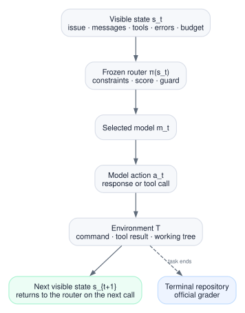

# Building a model router that knows when to spend

*A practical deep dive into model selection, calibration, quality-cost curves,
and per-call routing inside coding agents.*

*Pranav Dulepet*

Model routing is usually reduced to one sentence: send easy requests to a
cheap model and hard requests to a strong one.

That sentence is useful until you try to build the router.

A request is not simply easy or hard. It may be easy for one model and hard
for another. A cheap model is not useful merely because it is cheap. A
classifier score is not automatically a probability. A model with the best
predicted score may lack the required context window or tools. Inside an
agent, one route changes the state seen by every route that follows.

I built an open-source router to understand those problems directly. I began
with one-shot selection across 13 models and 11,658 prompts. I then moved the
decision inside a coding agent, where the router selected a model before each
inference.

The useful result came from the agent.

On 50 held-out SWE-bench tasks from repository families excluded from fitting,
the routed agent and a fixed Qwen3.6 35B agent each resolved 22 tasks. The
router cost $20.61. Fixed Qwen cost $26.02.

Across all 60 held-out tasks, the router resolved 26 and fixed Qwen resolved
24, at $24.54 and $30.98. The router sent 12.70% of its calls to GPT-OSS 20B.
Its paired quality interval still included both losses and gains, so the claim
is narrow: the router reduced cost at the observed pass rate. It did not prove
that routing is inherently more accurate.

Getting to that result changed my definition of a router:

> A classifier estimates which models fit a request. A router turns those
> estimates into a constrained, calibrated, and measurable decision.

## The router is allocating work

Let \(x\) be the information visible when a decision is made and
\(m\in\mathcal M\) a candidate model. The quantity I want is

\[
p_m(x)=P(\text{acceptable outcome}\mid x,m).
\]

This is not one difficulty score. It is a surface over requests and models.
For the same request, different models can have different probabilities. For
the same model, different requests can have different probabilities.

Routing only has value when four conditions hold:

1. The models occupy meaningfully different quality-cost points.
2. They disagree on some of the requests they solve.
3. Cheaper models are sufficient often enough to matter.
4. Something visible before inference predicts that sufficiency.

The first three can be measured with a hindsight oracle. Evaluate every model
on every request, then choose the cheapest successful model after seeing the
outcome. The oracle cannot be deployed, but it measures the opportunity in the
pool.

On the public 13-model prompt matrix I used, the oracle scored 87.70% at
$8.96. Fixed GPT-5 scored 73.52% at $56.52. There was substantial room for a
router.

The gap between the oracle and a learned router measures a different problem:
model recall. If only one candidate solves a request, can the router identify
it in advance? [LLMRouterBench](https://aclanthology.org/2026.findings-acl.1881/)
shows that this remains difficult even when model complementarity is strong.
Adding candidates can enlarge the oracle while making the routing problem
harder.

Model-pool design therefore comes before classifier design. I look at fixed
quality and cost, pairwise disagreements, unique solves, union-of-solves
coverage, and the marginal oracle gain from each candidate. Two models with
nearly identical costs and solve sets add little to a cost router.

## Four systems share the same name

Several products are called routers even though they act at different points.

| Router | Evidence available | Decision |
|---|---|---|
| Predictive model router | Request, context, model metadata | Select one model before generation |
| Cascade | Request and one or more generated answers | Accept an answer or escalate |
| Agent-step router | Current trajectory, tool results, errors, budget | Select the model for the next call |
| Provider router | Chosen model, endpoint health, region, cache | Select where and how to serve it |

A predictive router makes the cheapest decision and receives the least
evidence. [RouteLLM](https://proceedings.iclr.cc/paper_files/paper/2025/hash/5503a7c69d48a2f86fc00b3dc09de686-Abstract-Conference.html)
is the familiar binary form: predict when a strong model is worth using, then
sweep the threshold to trace a quality-cost curve.

A cascade buys more evidence. [FrugalGPT](https://arxiv.org/abs/2305.05176)
generates with one model, evaluates the answer, and escalates when confidence
is low. It can make a better-informed decision, but escalation pays for both
the rejected output and its replacement.

An agent-step router decides repeatedly. It can react to tool failures,
context growth, or a task that has become easier after a plan is established.
The price of that control is a feedback loop: each selected model changes what
the router will observe next.

A provider router starts after semantic model selection. It handles endpoint
availability, rate limits, regions, retries, deadlines, and cache locality.
Combining semantic fitness and provider health in one opaque score makes both
layers harder to train and debug.

My project focuses on predictive and agent-step routing. Provider execution
stays separate.

## The architecture I ended up with

The implementation has an offline path and an online path.


Offline training produces an immutable artifact:

- model cards describe prices, capabilities, and context limits;
- a complete outcome matrix supplies supervised labels;
- an estimator predicts model-relative success;
- calibration maps its scores to empirical probabilities;
- policy evaluation chooses allowed operating points; and
- the artifact stores the fallback, gates, hashes, and fitted parameters.

Online routing is deliberately smaller:

1. Remove models that violate hard constraints.
2. Estimate success for the remaining candidates.
3. Check whether the input and policy are supported.
4. Apply the chosen quality-cost rule.
5. Return a model ID and an auditable reason.

Calling a provider is a separate operation. This keeps credentials, retry
logic, and endpoint policy out of the learned artifact.

The separation matters because these parts fail differently. A classifier can
be miscalibrated. A policy can choose an unsafe operating point. A provider
can be unavailable. A request can fall outside the training distribution.
One score should not hide all four.

## Learning model-relative success

The training data is a complete request × model matrix:

\[
D=\{(x_i,m_j,y_{ij},c_{ij})\},
\qquad y_{ij}\in\{0,1\}.
\]

Every candidate sees every request. \(y_{ij}\) records whether model \(m_j\)
produced an acceptable result for request \(x_i\); \(c_{ij}\) records cost.

This removes a common source of bias. If expensive models are evaluated only
on hard requests, or new models only on recent traffic, the learner can
confuse the sampling policy with model ability. The open-source trainer
rejects incomplete matrices instead of silently filling the gaps.

All outcomes for one request stay in the same data split. For agent data, the
group should usually be a trajectory, repository, user, or account. A random
row split can put near-duplicate states on both sides of the evaluation.

I tested independent model heads, text nearest neighbors, calibrated gradient
boosting, and a shared classifier. The shared model was the most useful
general curve.

It uses hashed unigram and bigram features \(h(x)\), common request weights,
one bias per model, and one interaction block per model:

\[
z_m(x)=
b+w_{\text{shared}}^\top h(x)+b_m+w_m^\top h(x).
\]

The shared weights learn patterns that make a request broadly easy or hard.
The model bias learns each candidate's base rate. The interaction block learns
model-specific strengths. This is richer than a global easy/medium/hard label,
but it shares more statistical strength than unrelated classifiers.

The raw score is still not a probability. I fit a separate isotonic calibrator
for each model on a calibration split. If a model has degenerate calibration
labels or scores, the trainer falls back to a global calibrator rather than
inventing a per-model curve.

The policy can then compare quality and cost in the same decision:

\[
m^*(x)=\arg\max_{m\in\mathcal M(x)}
\left[
\hat p_m(x)
-\lambda \tilde c_m(x)
\right].
\]

Sweeping \(\lambda\) produces operating points instead of one universal
router. A quality-sensitive application can remain near the strong baseline.
A cost-sensitive application can move farther left.

Calibration does not make every operating point acceptable. The trainer tests
each candidate policy against the best fixed model on calibration data. A
policy that misses its quality gate cannot route by default. An unknown
weight, an unsupported input, or a close decision falls back to the fixed
model. If hard constraints also exclude the fallback, the router fails closed.

That last action—abstaining—is as important as choosing among models.

## What prompt routing showed me

I first tested this structure on a pinned public LLMRouterBench release:
151,554 outcomes from 11,658 prompts and 13 models spanning GPT, Claude,
Gemini, DeepSeek, Qwen, Kimi, GLM, and Intern families.

The grouped split used 6,542 prompts for fitting, 2,182 for calibration, and
2,184 for an untouched in-distribution comparison. A separate 750-prompt
ArenaHard set tested transfer. All 13 model outcomes for one prompt remained
together.


The shared classifier's most useful observed point scored 73.64% at $38.31.
Fixed GPT-5 scored 73.52% at $56.52. Its paired quality interval was -1.54 to
+2.02 percentage points; the cost-saving interval was 28.64% to 35.92%.

That point was selected from the frozen curve after test scoring. It was not
the prespecified primary configuration. The prespecified text-nearest-neighbor
router scored 65.93%. I treat the shared-classifier point as a useful observed
operating point, not proof that it will reproduce on arbitrary traffic.

The curve exposed three things.

First, shared request-model structure helped. The router could learn common
task signals without erasing model-specific behavior.

Second, the oracle gap was much larger than the differences among learned
methods. Better labels, pool curation, and model recall matter more than a
slightly larger classifier.

Third, probability calibration and distribution support are separate. On
ArenaHard, the frozen shared artifact stayed close to the fixed GPT-5
comparison at 40% lower benchmark cost. On 400 ARC-AGI grid tasks—absent from
training—it collapsed onto one cheap model and lost substantial quality.

The calibrator was answering, "How often is this score correct on represented
data?" It was not answering, "Does this input resemble represented data?"
A deployable router needs both questions and a strong fallback.

## Coding agents change the decision

A prompt router observes \(x\), chooses \(m\), and receives an outcome.

A coding agent creates a trajectory. At step \(t\), the router sees the issue,
messages, tool results, recent errors, context use, and remaining budget:

\[
s_t=
\left(
x,
\text{messages}_{<t},
\text{tool results}_{<t},
\text{errors}_{<t},
\text{context}_t,
\text{budget}_t
\right).
\]

It selects \(m_t\), the model produces action \(a_t\), and the environment
returns a new state:

\[
m_t=\pi(s_t),\qquad
s_{t+1}=T(s_t,m_t,a_t).
\]



This is why an agent router cannot be evaluated by replaying fixed-model
transcripts. Different models issue different commands, consume different
tokens, trigger different errors, and stop at different times. The routed and
fixed policies must each run their own trajectory to a terminal repository
state.

It also changes the classifier input. The original issue is no longer enough.
The router needs the visible prefix, but not gold patches, grader tests, future
messages, or terminal outcomes.

## The policy I put inside the agent

I used GPT-OSS 20B as the cheap arm and Qwen3.6 35B-A3B as the strong arm.
They had roughly a threefold list-price separation and both passed the same
tool and patch-submission checks.

The classifier estimates

\[
P(\text{needs strong model}\mid s_t).
\]

Its text representation includes the issue, recent messages, tool calls,
return-code indicators, recent errors, step counts, approximate context
length, and coarse code signals. A signed unigram/bigram hashing layer feeds a
calibrated logistic classifier.

I trained the estimator on public TwinRouterBench prefixes. Its labels
describe a target model tier, not paired GPT-OSS/Qwen outcomes, so I treated
them as a proxy for whether a visible state needed more than the lowest tier.
Repository-grouped fitting and calibration kept the held-out repository
families separate.

Repeated classification alone was too brittle. I wrapped it in four
conservative trajectory guards:

1. Start with two strong-model calls.
2. Use the strong model above 24,000 visible context tokens.
3. Stay strong for at least two calls after escalation.
4. Allow at most two consecutive cheap-model calls.

The classifier could propose a cheap call. The guards could only override
toward Qwen.

These rules encode risks that the public labels did not capture. The first
calls establish a plan. Long contexts need the larger arm. A dwell period
prevents oscillation. The burst limit stops a sequence of locally cheap
decisions from controlling too much of the trajectory.

I froze the classifier, threshold, and guards after a 20-task development
gate. The policy then moved to an untouched 60-task evaluation.

## The held-out agent result

Every task received three independent treatments under the same agent
scaffold, tools, and 75-call limit:

- fixed GPT-OSS 20B;
- fixed Qwen3.6 35B; and
- the guarded per-call router.

All 180 trajectories finished before official grades were opened.

| Policy | Officially resolved | Conservative cost |
|---|---:|---:|
| Fixed GPT-OSS 20B | 13/60 | $9.53 |
| Fixed Qwen3.6 35B | 24/60 | $30.98 |
| Guarded router | 26/60 | $24.54 |


The router saved $6.44, or 20.79%, relative to fixed Qwen. Five tasks were
router-only successes and three were Qwen-only. The paired cost-saving
interval was 9.91% to 30.57%. The paired quality interval was -6.67 to +13.33
percentage points.

The observed quality difference is therefore not the main result. The cleaner
comparison is the 50-task subgroup drawn from Astropy, Django, and Matplotlib,
whose repository families were excluded from fitting. Both policies resolved
22 tasks. The router saved 20.80%, with a paired cost-saving interval of
11.34% to 30.13%.

Those 50 tasks still come from only three repositories. Equal-weighting the
three repository results produces a weaker quality estimate with wide
uncertainty. More task rows do not substitute for more repository diversity.

The routing audit confirms that the policy did not save money by quietly
falling back to one model.


GPT-OSS handled 364 of 2,866 calls across 56 of 60 trajectories. Every
trajectory satisfied all four guards.

## Why the savings are larger than cheap-call repricing

The 364 GPT-OSS calls consumed 5.14 million input tokens and 112,429 output
tokens. They cost $0.98. Pricing those exact tokens at Qwen's rates gives
$2.93. Direct substitution therefore saved $1.95.

The full routed policy saved $6.44.

The difference came from behavior. Earlier model choices changed commands,
token counts, call counts, and stopping times. The router made 2,866 calls;
fixed Qwen made 3,226.

These are two distinct measurements:

- **Same-token repricing** isolates the mechanical saving on calls moved to
  the cheap model.
- **Policy-level comparison** measures the total cost of independently
  executed routed and fixed trajectories.

The second number is the product outcome. The first explains one of its
mechanisms.

This distinction matters whenever routing changes future work. It also
explains why model switching cannot be evaluated only from list prices. Cache
misses, longer prompts, retries, and changed stopping behavior belong in the
policy comparison.

## What public routers get right

The most useful production descriptions do not reveal every classifier
weight. They do reveal how the decision is divided.

| System | Public design | The useful idea |
|---|---|---|
| [Cursor](https://cursor.com/blog/router) | Request and context features, task and model behavior, cache-aware evaluation, large online tests | Measure the product outcome, including cache effects |
| [OpenRouter](https://openrouter.ai/docs/guides/routing/routers/auto-router) | Task classification, model ranking, allowlists, cost-quality control, fallbacks, session stickiness | Keep model choice separate from provider choice |
| [Not Diamond](https://docs.notdiamond.ai/docs/routing-between-custom-models) | Routers trained from application outcomes across custom models or agents | Treat representative evaluation data as the interface |
| [Ramp](https://builders.ramp.com/post/thompson-sampling-model-routing) | Online estimates of failure, latency, deadline risk, and relative cost | Learn runtime reliability separately from task fitness |
| [vLLM Semantic Router](https://github.com/vllm-project/semantic-router) | Domain, complexity, tool, privacy, and safety signals in a serving stack | Keep policy signals inspectable |

Cursor reports online measurements and exposes user-facing modes such as
Intelligence, Balance, and Cost. That is a quality-cost curve expressed as a
product control. Its cache-aware evaluation is especially important for
multi-call conversations.

OpenRouter's Auto route classifies the task and ranks models. Provider routing
then chooses an endpoint for the selected model. This boundary prevents a
temporary provider outage from changing the semantic definition of the task.

Ramp solves a narrower operational problem. Given an acceptable list of
models and service tiers, it updates failure and deadline estimates online and
reorders the choices. That is not a semantic quality classifier. It is a
runtime policy over already-approved options.

The designs converge on the same structure: representative feedback, a
tunable objective, hard filters, fallbacks, online measurement, and a separate
provider layer.

## The open-source router

I packaged the reusable part as an MIT-licensed, provider-neutral Python
library.

The user supplies:

- model cards with opaque IDs, capabilities, context limits, and prices;
- a complete train/calibration outcome matrix;
- an untouched evaluation matrix; and
- quality, cost, eligibility, and fallback settings.

The library provides:

- independent and shared estimators with per-model calibration;
- quality, balanced, and cost policies;
- hard capability filters and a one-sided quality gate;
- abstention, fixed fallback, and fail-closed behavior;
- content-hashed artifacts and auditable decisions;
- prompt and visible-agent-state adapters;
- a held-out evaluator; and
- an optional OpenAI-compatible proxy.

Training and routing happen locally:

```bash
pip install -e ".[ml,proxy]"

budget-router semantic-train \
  --outcomes examples/outcomes.example.jsonl \
  --model-cards examples/model_cards.example.json \
  --output outputs/semantic_router.json

budget-router semantic-route \
  --artifact outputs/semantic_router.json \
  --text "Debug a concurrent state-machine race" \
  --mode balanced
```

The route command returns a model ID without importing a provider SDK. The
proxy maps that ID to any OpenAI-compatible upstream. Credentials remain in
environment variables and never enter the artifact.

The generic `SemanticAgentRouter` handles arbitrary model pools from visible
messages. The repository also contains the exact guarded two-model policy used
for the held-out agent evaluation. One is the public framework; the other is a
frozen example of an evaluated policy.

The package does not guess about models with no data. A new candidate becomes
eligible only after representative outcomes are added and a new artifact
passes evaluation. New prices, tools, evaluators, or traffic distributions
also deserve a new artifact.

## What I would build next

The next version should route at two timescales.

A task-level router would choose an initial model from the issue, repository,
tools, and expected work. A step-level router would revise that choice as the
trajectory reveals errors, context growth, and progress.

I would evaluate that design on a newer or time-disjoint coding cohort with:

1. cheap, medium, and strong fixed baselines;
2. repeated trajectory seeds;
3. repository-level grouping;
4. explicit input-support detection;
5. quality, cost, latency, cache, and activation measurements; and
6. terminal grading only after every policy finishes.

The central lesson is not that cheap models should handle easy work. It is
that routing is a complete decision system. The model pool defines the
opportunity. Outcome data teaches relative fitness. Calibration makes scores
comparable. The policy prices tradeoffs. Constraints and abstention protect
the boundary. On-policy evaluation determines whether the system actually
worked.

On this workload, that system moved 12.70% of agent calls to a cheaper model
and reduced conservative cost by about one fifth while matching the fixed
strong model's observed result on the held-out repository-family subgroup.
That is the result I wanted from a router: not a cheaper model in isolation,
but a disciplined way to decide when to use it.

## Code, data, and further reading

The [README](../README.md) contains the API and quickstart. The
[production guide](open_source_router.md) covers data preparation, deployment,
and the proxy. The complete agent evidence remains in the
[held-out evaluation report](agent_step_router_v2_final_report.md).

Sanitized results are published in
[`public_router_v1_results.json`](../artifacts/public_router_v1_results.json)
and
[`agent_step_router_v2_results.json`](../artifacts/agent_step_router_v2_results.json).
The figures are generated from committed artifacts by
[`generate_blog_figures.py`](../scripts/generate_blog_figures.py). The PDF is
built with [`render_technical_blog.sh`](../scripts/render_technical_blog.sh).

Research:
[Shnitzer et al.](https://arxiv.org/abs/2309.15789);
[FrugalGPT](https://arxiv.org/abs/2305.05176);
[RouterBench](https://arxiv.org/abs/2403.12031);
[RouteLLM](https://proceedings.iclr.cc/paper_files/paper/2025/hash/5503a7c69d48a2f86fc00b3dc09de686-Abstract-Conference.html);
and [LLMRouterBench](https://aclanthology.org/2026.findings-acl.1881/).

Production and agent routing:
[Cursor](https://cursor.com/blog/router);
[OpenRouter](https://openrouter.ai/docs/guides/routing/routers/auto-router);
[Ramp](https://builders.ramp.com/post/thompson-sampling-model-routing);
[Not Diamond](https://docs.notdiamond.ai/docs/routing-between-custom-models);
[vLLM Semantic Router](https://github.com/vllm-project/semantic-router);
and [TwinRouterBench](https://github.com/CommonstackAI/TwinRouterBench).
